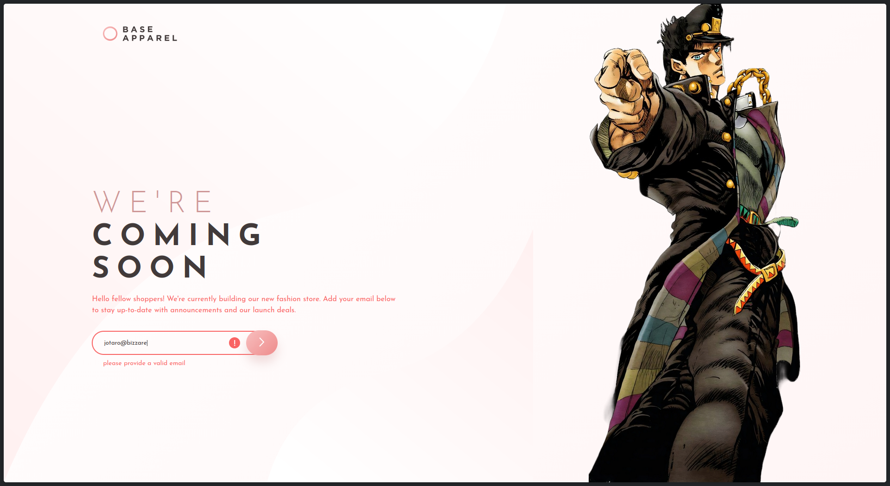

# Frontend Mentor - Base Apparel coming soon page solution

This is a solution to the [Base Apparel coming soon page challenge on Frontend Mentor](https://www.frontendmentor.io/challenges/base-apparel-coming-soon-page-5d46b47f8db8a7063f9331a0). Frontend Mentor challenges help you improve your coding skills by building realistic projects. 

## Table of contents

- [Overview](#overview)
  - [The challenge](#the-challenge)
  - [Screenshot](#screenshot)
  - [Links](#links)
- [My process](#my-process)
  - [Built with](#built-with)
  - [What I learned](#what-i-learned)
  - [Continued development](#continued-development)
  - [AI Collaboration](#ai-collaboration)
- [Author](#author)

## Overview
this challenge was bizzare
### The challenge

Users should be able to:

- View the optimal layout for the site depending on their device's screen size
- See hover states for all interactive elements on the page
- Receive an error message when the `form` is submitted if:
  - The `input` field is empty
  - The email address is not formatted correctly

### Screenshot

### Links

- Solution URL: [Add solution URL here](https://github.com/ArjunSharma-bit/Base-apparel-home.git)
- Live Site URL: [Add live site URL here](https://arjunsharma-bit.github.io/Base-apparel-home/)

## My process
do wrok
### Built with

- Semantic HTML5 markup
- CSS custom properties
- Flexbox
- CSS Grid
- Mobile-first workflow

### What I learned

its really hard to find png that are good quality use a bg eraser pref adobes its free and i didnt do it in mobile because i was tried

### Continued development
i want to get gud at flex

### AI Collaboration

used gemini to find a good bg eraser 

## Author

- Website - [Add your name here](Arjun Sharma)
